# DeviceControl

Repositório do desafio “Desafio Fullstack” para integração de dispositivos IoT com .NET 8 e Angular 19, utilizando Telnet via Ncat e Mock de API Devices com Postman.

## Descrição do Projeto

Este projeto implementa uma solução fullstack para consulta e controle de dispositivos IoT usando:

- **Backend** em C# (.NET 8)  
- **Frontend** em Angular 19 com PrimeNG e Tailwind CSS  
- **Autenticação** OAuth2 “fake” com JWT  
- **Comunicação Telnet** via ncat para simular dispositivos  
- **Mock de API Devices** no Postman seguindo especificação OpenAPI
- **Estrutura**

```markdown
DeviceControl/
├── src/
│   ├── IoTControl.API/          # Backend .NET 7
│   ├── ClientApp/               # Angular 19 + PrimeNG + Tailwind
│   ├── IoTControl.Application/  # Lógica de negócios
│   ├── IoTControl.Domain/       # Modelos de domínio
│   └── IoTControl.Infrastructure/ # Repositório e comunicação
├── tests/
│   ├── IoTControl.Tests.Unit/   # Testes Unitários (xUnit + Mock)
│   └── IoTControl.Tests.Integration/ # Testes de Integração
├── ProjetoIoTControl.sln
```

A interface web permite ao usuário:

1. Fazer **login** e armazenar token JWT.
2. Listar dispositivos cadastrados.  
3. Ver detalhes (fabricante, descrição, comandos).  
4. Executar comandos via Telnet e exibir resposta formatada.


## 🛠️ Tecnologias

- **Backend**: .NET 8 (C# 10)
- **Frontend**: Angular 19 + PrimeNG + Tailwind
- **Autenticação**: JWT com OAuth2 simulado
- **Testes**: xUnit + Mock
- **Ferramentas**: Postman (API Mock), Ncat (Telnet Server)


## Funcionalidades Implementadas

- **OAuth2 Fake**: fluxo de login por HTTP POST e armazenamento de JWT no `localStorage`.  
- **Listagem de Dispositivos**: consumo do endpoint `GET /api/devices`.  
- **Detalhes do Dispositivo**: exibição de manufacturer, description e lista de comandos.  
- **Execução de Comandos**: formulário dinâmico de parâmetros + chamada Telnet via backend.  
- **Mock Devices**: collections do Postman adaptadas com OpenAPI e exemplos.  
- **TelnetService**: envio de comandos a `localhost:2323`, retorno de JSON via ncat.  
- **Testes Unitários (xUnit + Mock)**: cobertura de `DeviceService` e `CommandService`.

## Pré-requisitos

- [.NET 8 SDK](https://dotnet.microsoft.com/download)  
- [Node.js ≥ 16.x](https://nodejs.org/)  
- [Angular CLI](https://angular.io/cli) (`npm install -g @angular/cli`)  
- [ncat (nmap)](https://nmap.org/ncat/)  
- [Postman](https://www.postman.com/) (para Mock Devices)


## Configuração

1. **Clone o repositório** 
```bash
   git clone https://github.com/silvio-swat/device-control.git
   cd device-control
```

2. **Iniciar Telnet Mock com Ncat**

- Faça o download e instalação do Ncat Acessando [ncat (nmap)](https://nmap.org/ncat/)  

- Editar o arquivo device-control\tests\TelnetTester\helper\ncat-mock\run-mock.bat e alterar o caminho de "telnet-mock.ps1"
No exemplo abaixo o caminho de telnet-mock.ps1 está em:
%userprofile%\source\repos\device-control\tests\TelnetTester\helper\telnet-mock.ps

```bash
@echo off
REM Esse batch chama o seu script PowerShell com as aspas corretas
powershell -NoProfile -ExecutionPolicy Bypass -File "%userprofile%\source\repos\device-control\tests\TelnetTester\helper\telnet-mock.ps1" -Verbose
```

- Executar o comando abaixo apontando o arquivo run-mock.bat dentro do projeto
No meu caso está em C:\Users\kooma\source\repos\device-control\tests\TelnetTester\helper\ncat-mock\run-mock.bat
```bash
ncat --listen --keep-open --verbose --exec C:\Users\kooma\source\repos\device-control\tests\TelnetTester\helper\ncat-mock\run-mock.bat -p 2323
```

- Se estiver correto deve aparecer as informações logo abaixo do comando
```bash
Ncat: Version 7.95 ( https://nmap.org/ncat )
Ncat: Listening on [::]:2323
Ncat: Listening on 0.0.0.0:2323
```

3. **Configurar Mock de Devices no Postman**

- Faça o download e instalação do Postman Acessando [Postman](https://www.postman.com/) 

- Após instalar e abrir o postman, clique em importar na tela inicial

- Localize o importe o arquivo da pasta do projeto \device-control\tests\CIoTD API Mock.postman_collection.json

- Clique nos três pontinhos da collection importada com nome de CIoTD API Mock | More |Mock

- Insira um nome ao Mock Server e selecione a collection importada
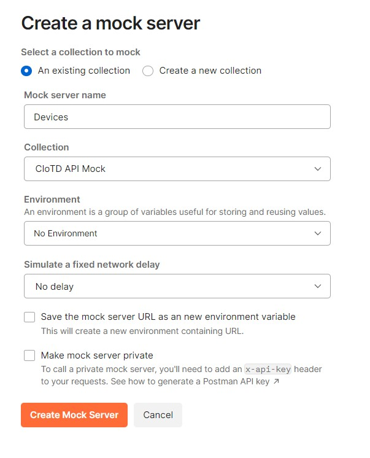
  
- Copie a URL do Mock Server Criado
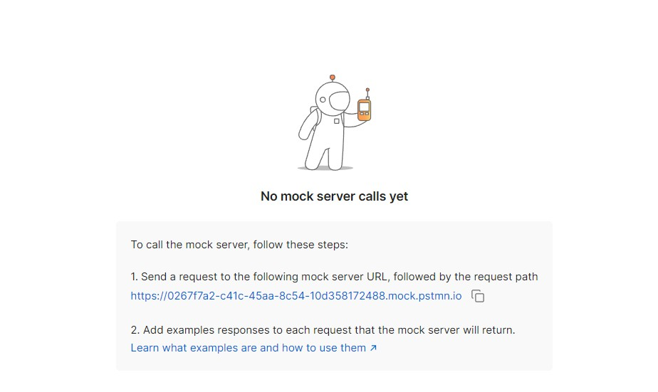

- Clique em uma requição da collection e insira a Url conforme imagem abaixo, a url será replicada para outras requisições
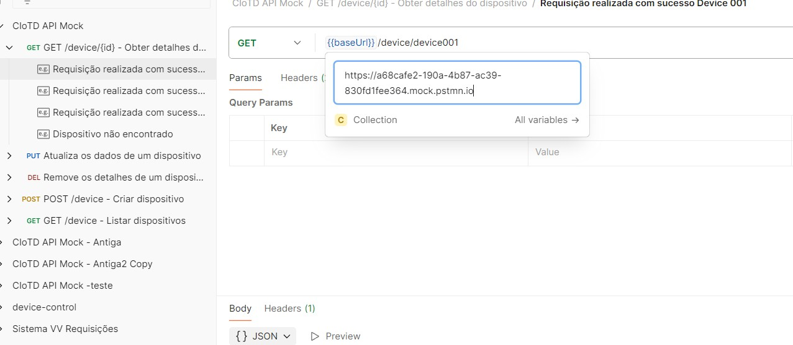

- Edite o arquivo do projeto device-control\src\IoTControl.API\Program.cs
Abaixo insira a url do Mock Server em client.BaseAddress, conforme exemplo abaixo:
``` C#
   client.BaseAddress = new Uri("https://2f8e4356-9f20-47af-bb45-d9f86a3b8858.mock.pstmn.io");
```

**Siga a ordem de iniciar primeiro o front-end para depois iniciar o back-end**

4. **Frontend (Angular)**
   - Para iniciar o servidor front-end Angular 19, Abra um powershell e siga os passos abaixo:
   - Execute o npm install somente uma vez para instalar todos os modulos npm necessários
```bash
cd src/ClientApp
npm install
```
   - Para iniciar o servidor front-end use o comando
```bash
npm start
```

6. **Backend (.NET)**
- Para iniciar o servidor back-end, Abra outro powershell siga os passos abaixo:
```bash
cd src/IoTControl.API
dotnet restore
dotnet run
```

7. **Acesso ao sistema**
Após iniciar o  Telnet Mock com Ncat, Mock de Devices no Postman, Frontend (Angular) e Backend (.NET):
- Acesse o link **https://localhost:7112/**
Será exibido a tela de login
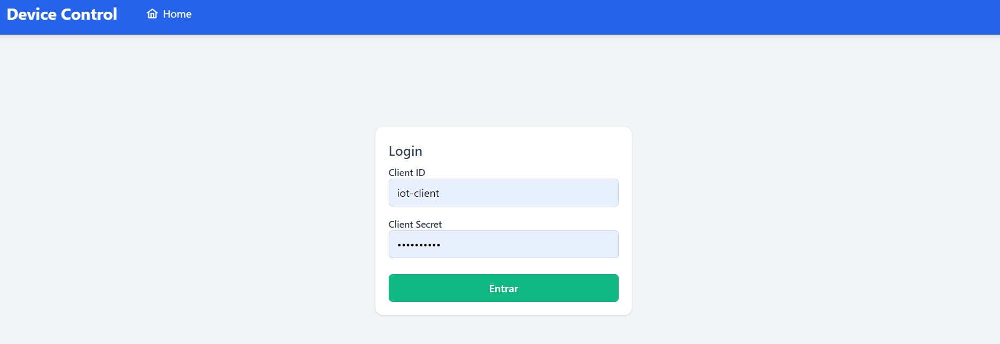

Digite:
Usuário: iot-client | 
Senha: iot-secret

- Depois do Login será exibido a tela de dispositivos, clique no botão de configuração de qualquer dispositivo
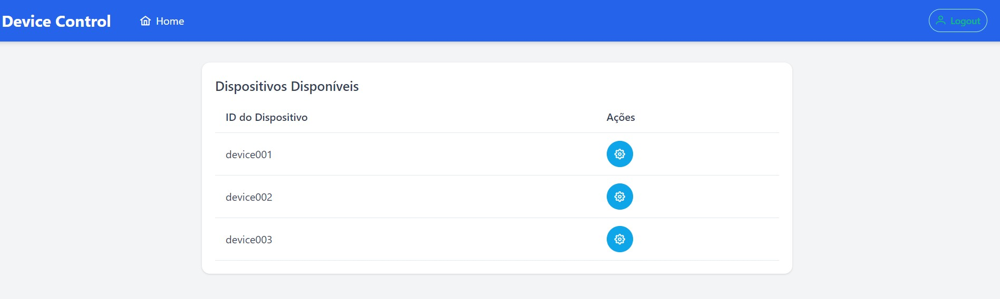

- No detalhe de dispositivo, escolha um comando e clique em "Executar comando"
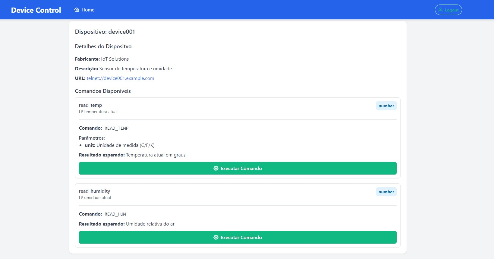

- Digite uma das unidades de medida e clique em executar
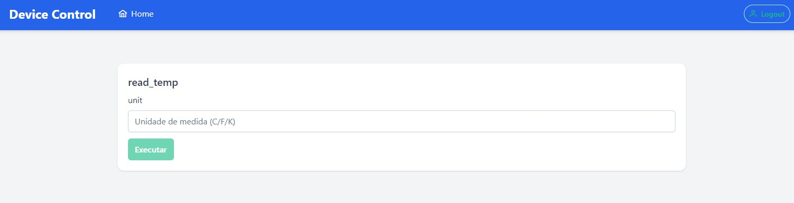

- Será exibido o resultado vindo do Telnet Ncat ao back-end .Net C# até chegar ao front-end Angular 19
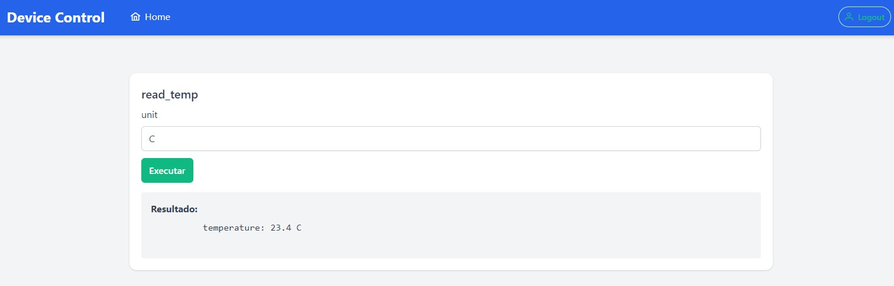

- Neste outro exemplo, clique em set_brightness
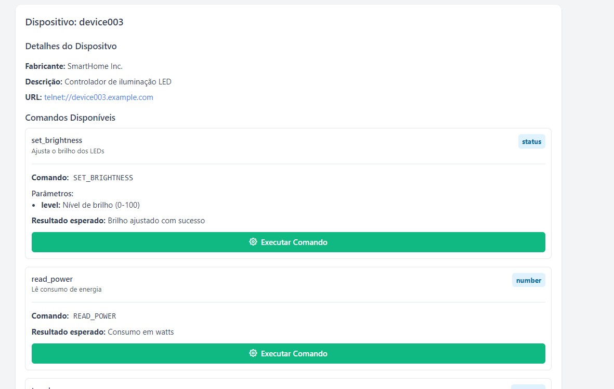

- Digite o valor de brilho
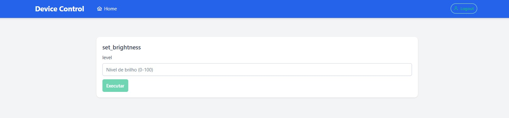

- Será exibido o resultado vindo do Telnet Ncat ao back-end .Net C# até chegar ao front-end Angular 19
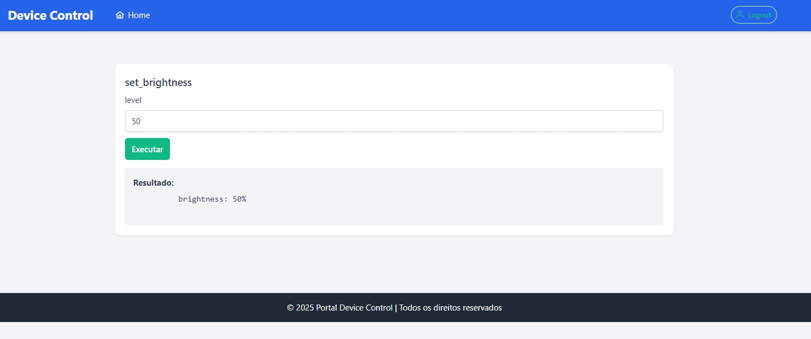

Existem comandos que não precisam de envio de parâmetro, bastando apenas executar e aguardar o resultado conforme exemplo abaixo:
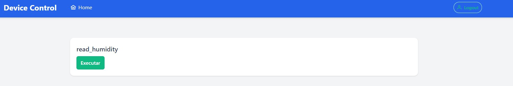


## Testes Unitários

- **Unitários:**
``` bash
cd tests/IoTControl.Tests.Unit
dotnet test
```
- **Exemplo de Teste** DeviceServiceTests.cs e CommandServiceTests.cs implementados com xUnit e Mock.

## Decisões de Design

- Arquitetura em camadas (API, Application, Domain, Infrastructure) para separar responsabilidades.

- HttpClient injetado via DI para facilitar mock nos testes.

- TelnetService isolado para reuso e testes: métodos async retornam string.

- OAuth2 fake: simplificação do fluxo de autenticação sem depender de Identity Server real.

- Angular + PrimeNG: agilidade na criação de tabelas e formulários; Tailwind para estilo responsivo.

- Mock de Devices com Postman torna os testes mais ageis

- Ncat como Telnet Server permite simular dispositivos reais

## Melhorias Futuras
- Substituir Mock OAuth2 por Identity Server real ou Azure AD.

- Adicionar testes de integração end-to-end no frontend.

- Documentação interativa da API via Swagger UI.

- Serviço de logs centralizado e monitoramento (Serilog + Seq).

- Deploy automatizado (CI/CD) em Azure DevOps ou GitHub Actions.

Repositório GitHub: https://github.com/silvio-swat/device-control
